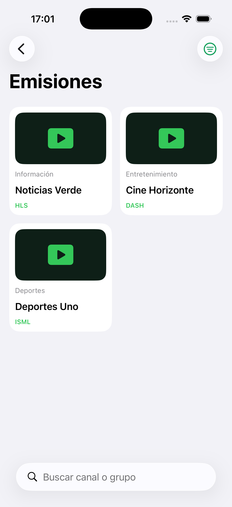
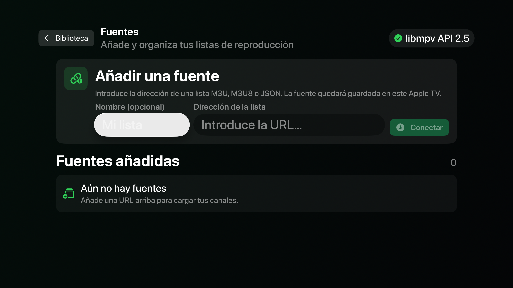

# InputStream Player

Public repository for InputStream Player. It contains public information about
the app, compatible playlist examples, and verifiable releases.

> InputStream Player is intended for content the user is authorized to access.
> It does not include third-party playlists, credentials, or keys.

## Screenshots

### iOS

### tvOS

## Compatibility

- Versions are available for **iOS**, **tvOS**, and **macOS**.
- **HLS** (`.m3u8`), including **SAMPLE-AES** when the source provides an
  authorized ClearKey/raw key.
- **DASH / MPD** (`.mpd`) with CENC and an authorized ClearKey/raw key.
- **Microsoft Smooth Streaming** (`.ism` / `.isml` and `Manifest`) with an
  authorized ClearKey/raw key.
- **M3U/M3U8** and **JSON** sources.

FairPlay, Widevine, and PlayReady licenses requiring a license server are not
supported. Only add a key to a playlist when the content owner has expressly
authorized its use.

## Playlist examples

- [M3U/M3U8](samples/inputstreamplayer_en.m3u): HLS, DASH/MPD, and Smooth
  Streaming, with and without ClearKey.
- [JSON](samples/inputstreamplayer_en.json): compatible flat JSON format.
- [Full playlist format reference](docs/formatos-de-listas_en.md).

The sample combines structural examples with public third-party demonstrations.
Availability of demonstrations depends on their providers; keys used in the
structural examples are placeholders.

## Releases

Published versions will appear under this repository's
[Releases](../../releases) section. Each IPA is accompanied by its SHA-256
checksum and release notes.

Read [how to verify and install a release](docs/releases_en.md) before
installing it. SideStore distribution requires a valid Apple account and is
subject to Apple's signing limits.

## Installing on iPhone and iPad

Install InputStream Player with **SideStore**, preferably inside
**LiveContainer**. Download the IPA from an official release and first follow
the official installation guides:

- [Install SideStore](https://docs.sidestore.io/docs/installation/install)
- [Install LiveContainer with SideStore](https://livecontainer.github.io/docs/installation)

Once LiveContainer is configured, import the InputStream Player IPA from the
official release. LiveContainer runs it inside its container.

## Repository scope

This repository does not publish source code, keys, signing profiles,
credentials, or third-party material. Public issues should contain only data
that can safely be shared.
