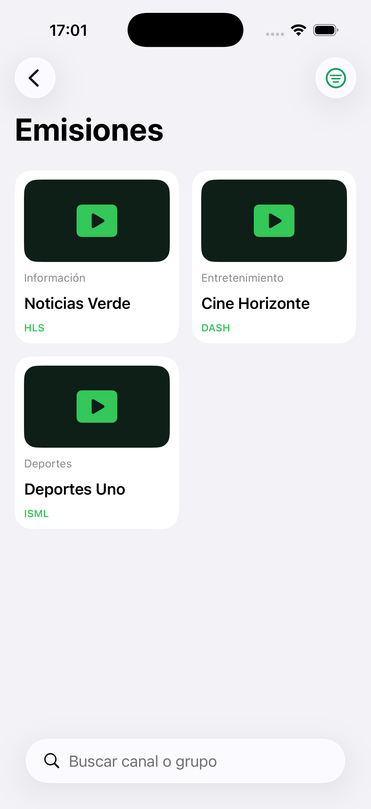
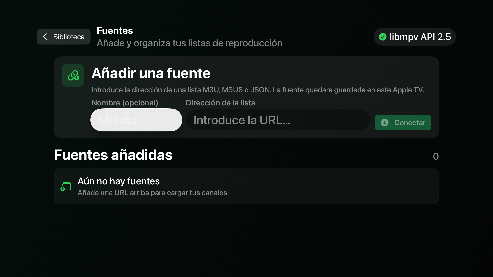

# InputStream Player

Public repository for InputStream Player. It contains public information about
the app, compatible playlist examples, and verifiable releases.

In app drawers and on the home screen the app shows up as **ISPlayer**; inside
the app it uses its full name.

> InputStream Player is intended for content the user is authorized to access.
> It does not include third-party playlists, credentials, or keys.

[Versión en español](README.md)

## Downloads

- **Latest version:** [releases/latest](https://github.com/jopsis/InputStreamPlayer/releases/latest)
- **All versions:** [Releases](https://github.com/jopsis/InputStreamPlayer/releases)
- **iPhone and iPad:** preferably through the [SideStore source](#add-inputstream-player-as-a-sidestore-source),
  which tells you about every new version.
- **Android:** after the first install, the app updates itself
  (Ajustes → Buscar actualizaciones).

Every file comes with its SHA-256 checksum. Before installing, read
[how to verify and install a release](docs/releases_en.md).

## Screenshots

### iOS

### tvOS

## What it does

- **Live TV** with a programme guide (XMLTV, plain or gzipped), channel
  zapping with the remote, and **catch-up** to watch what already aired when
  the playlist declares the channel's archive ([how to declare it](docs/formatos-de-listas_en.md#catch-up)).
- **On demand:** the movies and series in your playlists, with series grouped
  by season, "Continue" where you left off, and watched marks. JSON catalogs
  can carry full details (plot, cast, year, genres, runtime) and a trailer
  ([format](docs/formatos-de-listas_en.md#movie-and-series-catalogs-json)).
- **Stremio add-ons:** catalogs, detail pages with trailers (from TMDb), and
  streams from the add-ons you add, plus Trakt lists. Cinemeta (catalogs and
  details) and **OpenSubtitles** (subtitles in your language even when the
  video has none) come built in; other subtitle add-ons work too.
- **Tracks:** pick the video quality, audio language, and subtitles. The
  preferred language is set in Settings, and a track picked by hand is
  remembered per channel.
- **Optional sync** of sources, settings, and watch history across your
  devices through your own Google Drive, and with **Trakt**.
- **Optional encrypted DNS** (XDP DNS), for networks whose DNS blocks some
  servers.
- **Android:** in-app updates and "Enviar registro" (send log) to share a
  diagnostics log with keys and tokens removed.

The app's interface is in Spanish.

## Compatibility

- Versions for **iOS** (iPhone and iPad), **tvOS**, **macOS** (Apple Silicon
  Macs, through PlayCover and with a limited experience; see below), and
  **Android** (phone, Google TV and Android TV, 32- and 64-bit).
- **HLS** (`.m3u8`), including **SAMPLE-AES** when the source provides an
  authorized ClearKey/raw key.
- **DASH / MPD** (`.mpd`) with CENC and an authorized ClearKey/raw key,
  including a different key per track.
- **Microsoft Smooth Streaming** (`.ism` / `.isml` and `Manifest`) with an
  authorized ClearKey/raw key.
- Direct video files (MP4, MKV, TS…).
- **M3U/M3U8** and **JSON** sources (including OTT Navigator's movie and
  series catalogs), by URL or from a file, and encrypted `.ispl` playlists.

FairPlay, Widevine, and PlayReady licenses requiring a license server are not
supported. Only add a key to a playlist when the content owner has expressly
authorized its use.

## Playlist examples

- [M3U/M3U8](samples/inputstreamplayer_en.m3u): HLS, DASH/MPD, and Smooth
  Streaming, with and without ClearKey.
- [JSON](samples/inputstreamplayer_en.json): flat channel format.
- [JSON catalog](samples/catalogo-vod.json): an on-demand movie and series,
  with details and a trailer.
- [Full playlist format reference](docs/formatos-de-listas_en.md).

The samples combine structural examples with public third-party
demonstrations. Availability of demonstrations depends on their providers;
keys used in the structural examples are placeholders.

## Installing on iPhone and iPad

InputStream Player is installed through **SideStore**, preferably inside
**LiveContainer**. First follow their official installation guides:

- [Install SideStore](https://docs.sidestore.io/docs/installation/install)
- [Install LiveContainer with SideStore](https://livecontainer.github.io/docs/installation)

SideStore distribution requires a valid Apple account and is subject to
Apple's signing limits.

### Add InputStream Player as a SideStore source

Instead of downloading the IPA by hand on every release, add this repository
as a **source** in SideStore and new versions will show up there with an
"Update" button:

- Direct button (open it on the iPhone/iPad, it does not work on desktop):
  [`sidestore://source?url=https://jopsis.github.io/InputStreamPlayer/sidestore/apps.json`](sidestore://source?url=https%3A%2F%2Fjopsis.github.io%2FInputStreamPlayer%2Fsidestore%2Fapps.json)
- Add it by hand in SideStore → Sources → **+** → Add Source:
  `https://jopsis.github.io/InputStreamPlayer/sidestore/apps.json`
- Page with more detail: [sidestore/](https://jopsis.github.io/InputStreamPlayer/sidestore/)

Once LiveContainer is set up, import the InputStream Player IPA (from the
official release or from the SideStore-managed install) to run it inside its
container.

> **If you use LiveContainer, first enable "Fix File Picker"** in
> InputStream Player's settings inside LiveContainer. Without it, adding a
> playlist "from a file" opens the picker but nothing is imported when you tap
> "Open". Why, and the alternatives, in
> [how to verify and install a release](docs/releases_en.md#required-livecontainer-setting-the-file-picker).

## Apple TV

Each release includes `InputStreamPlayer-tvOS-X.Y.Z-N-unsigned.ipa`. SideStore
does not install Apple TV apps: you need to sign it with your own Apple account
and install it with the tool you use for that.

## Android (phone, Google TV and Android TV)

Each release includes three APKs:

- `InputStreamPlayer-Android-arm64-…apk`: modern 64-bit phones and TVs.
- `InputStreamPlayer-Android-armv7-…apk`: 32-bit TVs, such as Chromecast with
  Google TV.
- `InputStreamPlayer-Android-universal-…apk`: works on both; it is larger. If
  you are not sure which one you need, use this one.

Download the APK from the [latest version](https://github.com/jopsis/InputStreamPlayer/releases/latest)
and verify its `.sha256` checksum. Allow installs from unknown sources when the
system asks. On Google TV or Android TV, use a browser, a USB stick, or `adb`
to transfer the APK.

Once installed, the app looks for new versions by itself (and by hand, under
**Ajustes → Buscar actualizaciones**): it downloads the APK for your device,
checks its SHA-256 against the published one, and opens the system installer.

## Apple Silicon Macs (PlayCover)

Each release includes `InputStreamPlayer-macOS-PlayCover-X.Y.Z-N.ipa`: the same
iPhone app, prepared to be installed on an M-series Mac through
[PlayCover](https://playcover.io). Drag it into PlayCover and open it from
there.

It is an option **with a limited experience**:

- It only works on **Apple Silicon** Macs (M1 or later). There is no way to run
  it on Intel Macs.
- It is an iPhone/iPad app in a window, designed for a touch screen: no Mac
  menus and few keyboard shortcuts.
- If a button or menu does not respond, turn off PlayCover's **keymapping** for
  this app (right-click the app in PlayCover → Settings).

Playback is the same as on iPhone. To install on iPhone or iPad use the iOS
IPA, not this one.

## Privacy

The app has no servers of its own and no analytics. What data it handles and
where it stays: [privacy policy](privacidad.md).

## Issues

Open an [issue](https://github.com/jopsis/InputStreamPlayer/issues) with the
version, the device, and what happens. Do not include playlists, keys, tokens,
or private addresses. On Android, **Ajustes → Preferencias → Enviar registro**
creates a log with that data already hidden.

## Scope of this repository

This repository does not publish source code, keys, signing profiles,
credentials, or third-party material. Public issues should only include data
that can be shared safely.
